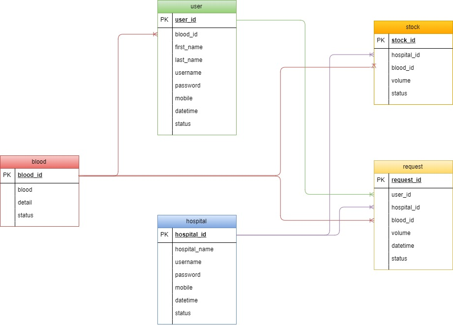
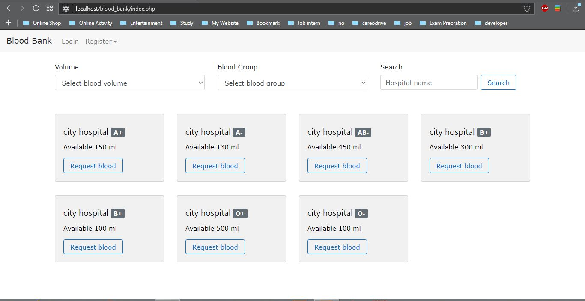
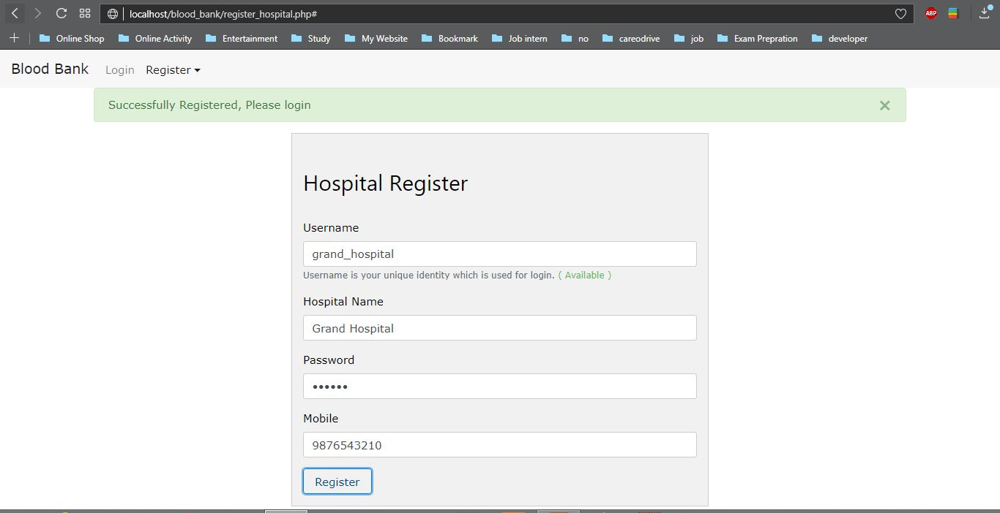
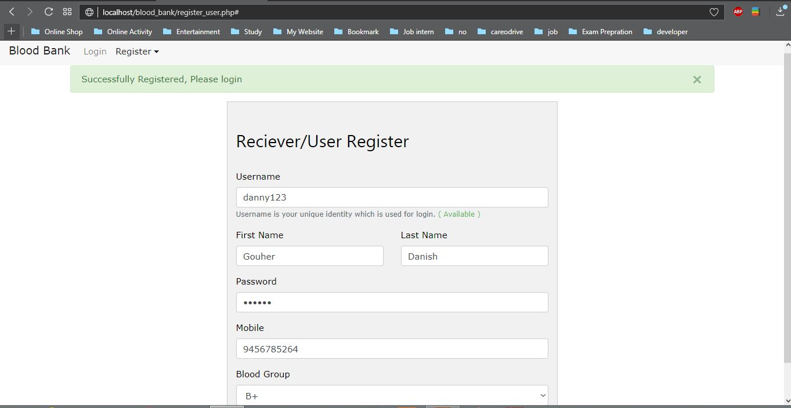
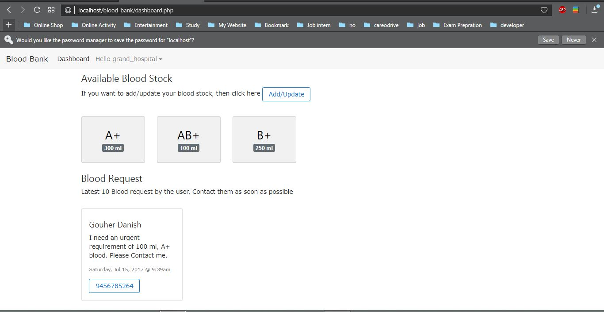
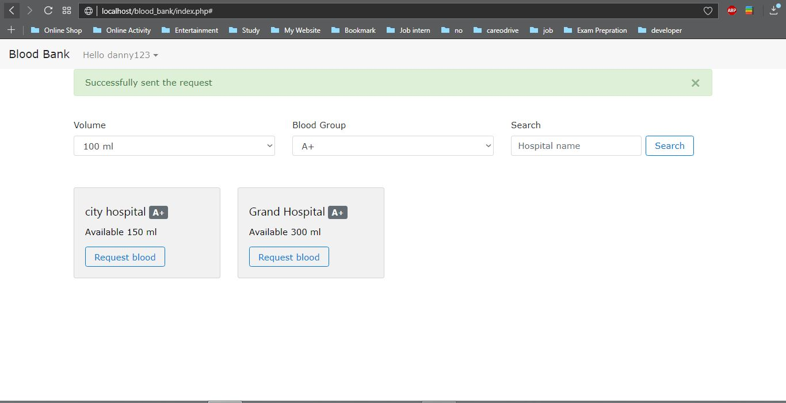

# Blood Bank
A simple blood bank project. 

Full Documentation [Click here](https://nfraz007.github.io/blood_bank/)

# Problem Statement
1) Assume you are designing a real-life system, that will be used by real users.
2) The application should contain 2 types of users: Hospitals and Receivers
3) Pages to be developed-
* ‘Registration’ pages - Different registration pages for hospitals & receivers. Capture receiver’s blood group during registration.
* ‘Login’ pages - Single/different login pages for hospitals & receivers.Hospital ‘Add blood info’ page - A hospital, once logged in, should be able to add details of available blood samples (along with type) to their bank. Access to this page should be restricted only to hospitals. 
* ‘Available blood samples’ page - There should be a page that displays all the available blood samples along with which hospital has them and a ‘Request Sample’ button. This page should be accessible to everyone, irrespective of whether the user is logged in or not. Expected functionality on click of the 'Request Sample' button-  
** Only receivers should be able to request for blood samples by clicking the ‘Request Sample’ button. Make sure that only those receivers who are eligible for the blood sample are allowed to click the button.
** If the user is not logged in, then he/she should be redirected to the login page.
** If a user is logged in as a hospital, then the user should not be allowed to request for a blood sample.
* Hospital ‘View requests’ page - Hospitals should be able to see the list of all the receivers who have requested for particular blood group from its blood bank.

# Technologies: 
* front-end : HTML , CSS , JavaScript , Jquery , Bootstrap 
* back-end : PHP, Mysqli, JSON
* Software : Xampp, Any browser

# Setup and Installation
* Download the zip file of this directory.
* Copy the file into your xampp htdocs location. by default the location is **C://xampp/htdocs**
* Open the xampp controller and start Apache and Mysql
* Open any browser any type **localhost/phpmyadmin** in the URL
* Create a new database **blood_bank**
* Select this database and click on **import** section. select this file : **C://xampp/htdocs/blood_bank/sql/blood_bank.sql**, and hit OK. It will create all the relevant table for this project.
* Now everything is set. Open your browser any type this : **localhost/blood_bank**

# ER diagram
* Entity relationship diagram of this project

# Snapshot
* Landing page where no login is required. Any one can access this page. If a user is logged-in then after clicking the request button, the request will be sent to the hospital. If Hospital is logged-in then request button will be disabled for them. And if no one is logged-in, then after clicking on request button, you will be redirected to login page.

* This is the registration for Hospitals.

* This is the registration for Users/Recievers.

* This is dashboard for hospitals which is specifically accessible for them. Here hospitals can see their blood's stock. They can add or update the blood stock very easily. Here they can also see the list of users who have requested for the blood samples. They can see the contact details of the users and contact them by their mobile number.

* If a user wants 100 ml A+ blood, then the user can apply filter in the landing page and request with the blood bank which have 100 ml of A+ blood.

